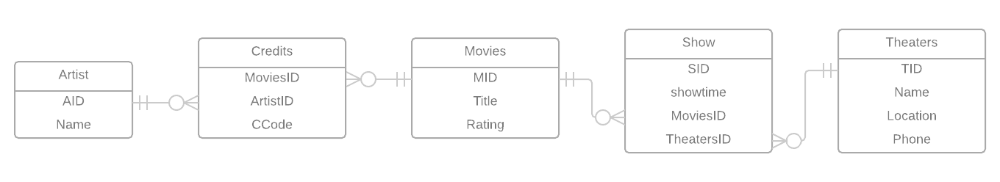

# "Data Modeling Notes"

## "Normalization Analysis"

### "1NF Conversion"
DATASHEET(<u>TName</u>, Location, Phone,<u>Mtitle</u>,<u>Showtime</u>, Rating, <u>CCode</u>, <u>CName</u>)

### '2NF Conversion'
TName --> (Location, Phone)
Mtitle --> (Rating)

TName(<u>Location</u>,Phone)
Mtitle(<u>Rating</u>)
DATASHEET(<u>TName</u>,Mtitle, Showtime,Ccode, CName)

### "3NF Conversion"
TName, Mtitle-->Showtime

Theaters(<u>TName</u>, Location, Phone)
Movies(<u>Mtitle</u>, rating)
Credits(<u>Mtitle</u> Ccode, CName)
Shows(<u>TName</u>, Mtitle, Showtime)

### "BCNF Conversion"
ArtistID ---> Credits
MID --> showtime

Theaters(<u>TID</u>,TName,Location, Phone)
Movies(<u>MID/u>, Mtitle, Rating)
Credits(<u>MID</u>, Ccode, ArtistID)
Shows(<u>TID</u>, MID,showtime)
Artists(ArtistID, name)

## "Entity Relationship Model"

